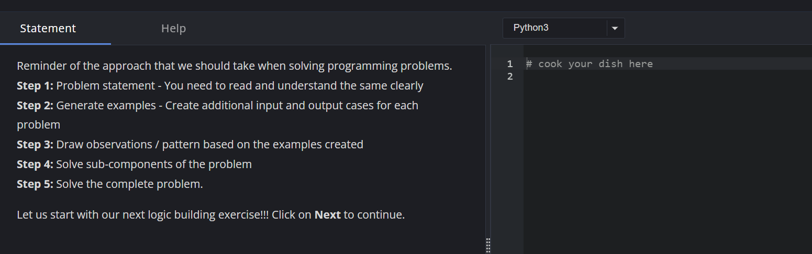

# heading 
## subhead
### xdgfdgdg
#### fgdfgdr gdfg
##### fgccffcgc

# ydftgdft
- rfctcf
- gyhgy
    - gchf
    - ygfyfty
        - yfdtgfdt
        - yftfy
    - ydftftyd
    - fghfg
- vhjgj
    - fghfh
    - gfgfghgf
- fgyhgf
- fyghf


hvcggc



# code snip
`print('hello world')`

print('hello world')

```
for i in range(10):
    print(i)
```
`for i in range(10):
    print(i)`

